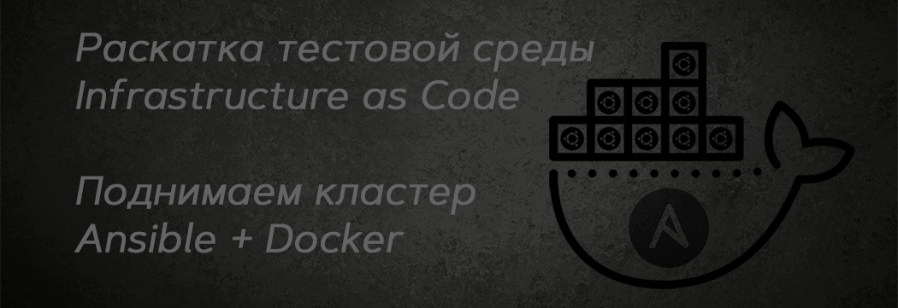

Демонстрационный проект для Ansible, включающий в себя разворачивание тестовой среды с использованием Infrastructure as Code (IAC) на Ubuntu с Docker.

## Оглавление

- [Описание проекта](#описание-проекта)
- [Структура проекта](#структура-проекта)
- [Как использовать](#как-использовать)
  - [Клонирование репозитория](#клонирование-репозитория)
  - [Установка зависимостей](#установка-зависимостей)
  - [Настройка переменных](#настройка-переменных)
  - [Использование pre-commit](#использование-pre-commit)
  - [Использование ansible-lint](#использование-ansible-lint)
- [Основные команды](#основные-команды)
  - [Разворачивание тестовой среды](#разворачивание-тестовой-среды)
  - [Остановка инстансов](#остановка-инстансов)
  - [Удаление инстансов](#удаление-инстансов)
  - [Обновление ключей](#обновление-ключей)
- [Автоматическая проверка качества кода](#автоматическая-проверка-качества-кода)
- [Участие](#участие)
- [Лицензия](#лицензия)


## Описание проекта

Проект предназначен для автоматизации развертывания тестовой среды на базовых операционных системах Ubuntu с использованием Ansible и Docker. Целью является обеспечение быстрого и надежного способа развертывания окружений для тестирования или разработки, минимизируя ручной труд и повышая консистентность конфигураций.

При выполнении [команды деплоя](#разворачивание-тестовой-среды), поднимается кластер инстансов в Docker на основе Ubuntu. Эти контейнеры могут быть предварительно сконфигурированы для запуска различных сервисов, таких как базы данных, веб-серверы, приложения и т.д., в зависимости от требований к тестовой среде.

После успешного выполнения команды деплоя, пользователь получает полностью функциональную тестовую среду, которая готова к использованию для проведения тестирования, разработки или демонстрационных целей. Среда включает в себя все необходимые сервисы и приложения, запущенные в изолированных Docker контейнерах, что обеспечивает легкость масштабирования и обновления. Также пользователь получает возможность легко останавливать и удалять среду, когда она больше не нужна, благодаря предоставленным скриптам остановки и удаления.

### Используемые технологии

- **Ansible**: инструмент автоматизации, который управляет конфигурацией и развертыванием систем
- **Docker**: платформа для разработки, доставки и запуска приложений в контейнерах
- **Python**: язык программирования, необходимый для работы модулей Ansible и некоторых скриптов
- **pre-commit**: инструмент для автоматического запуска линтеров перед коммитом


## Структура проекта

Проект состоит из следующих основных компонентов:

```bash
├── .ansible-lint
├── .ansible-lint-ignore
├── .gitignore
├── .pre-commit-config.yaml
├── LICENSE
├── README.md
└── ubuntu-cluster
    ├── inventory.ini
    └── playbooks
        ├── deploy
        │   ├── .env
        │   ├── Dockerfile
        │   ├── deploy_ubuntu.yaml
        │   └── vars.yaml
        ├── remove
        │   └── remove_ubuntu.yaml
        └── stop
            └── stop_ubuntu.yaml
```


## Как использовать


### Клонирование репозитория

```sh
git clone git@github.com:ilugovoy/testing-environment.git && cd testing-environment
```


### Установка зависимостей

Для корректной работы с проектом необходимо установить следующие зависимости:
- **Python 3.x**: Если Python не установлен, выполните `sudo apt update && sudo apt install python3`
- **Docker**: Следуйте [официальной инструкции](https://docs.docker.com/get-docker/) для установки Docker
- **Ansible и ansible-galaxy**: Установите с помощью команды `sudo apt-get update && sudo apt-get install ansible ansible-galaxy`
- **Docker Collection для Ansible**: Установите с помощью команды `ansible-galaxy collection install community.docker`
- **ansible-lint**: Утилита для проверки кода Ansible на соответствие стандартам и лучшим практикам. Установите с помощью команды `pip install ansible-lint`
- **pre-commit**: Инструмент для автоматического запуска линтеров перед коммитом. Установите с помощью команды `pip install pre-commit`

Также обратите внимание на файлы `.ansible-lint` и `.ansible-lint-ignore` в вашем проекте. Эти файлы используются для настройки правил линтинга и игнорирования определённых правил. После установки `ansible-lint`, вы можете запустить проверку вашего кода Ansible с помощью команды `ansible-lint`.


### Настройка переменных

Перед запуском playbook убедитесь, что файл `ubuntu-cluster/playbooks/deploy/vars.yml` содержит актуальные данные для подключения к вашей удаленной машине. В этом файле вы можете указать адрес хоста, пользователя и другие необходимые параметры.

<details>
  <summary>Шаблон файла с переменными окружения</summary>

Добавить файл .env, подставить ваши значения после `=`
```text
USERNAME=
PASSWORD=
```
</p>
</details>


## Использование pre-commit

Для начала работы с `pre-commit`, убедитесь, что у вас установлен Python и pip.

Затем выполните следующие команды в корне вашего проекта:
1. Установите `pre-commit`
2. Проверьте наличие файла `.pre-commit-config.yaml` в корне проекта
3. Инициализируйте `pre-commit` командой `pre-commit install`

Теперь каждый раз, когда вы попытаетесь сделать коммит, `pre-commit` автоматически запустит указанные хуки, проверяя ваш код на наличие ошибок и несоответствий стилю, в соответствии с правилами, прописанными в `.pre-commit-config.yaml`


## Использование ansible-lint

`ansible-lint` — это утилита, которая помогает поддерживать код Ansible чистым и последовательным, проверяя его на соответствие стандартам и лучшим практикам.

Чтобы использовать `ansible-lint` в вашем проекте, выполните следующие шаги:
1. Установите `ansible-lint`
2. Запустите `ansible-lint` для проверки ваших playbook и ролей `ansible-lint ubuntu-cluster/playbooks/`

Если вы хотите изменить правила линтинга, отрегулируйте файл `.ansible-lint` в корне вашего проекта. Этот файл позволяет настроить критерии, которые `ansible-lint` будет использовать для проверки вашего кода.

Файл `.ansible-lint-ignore` используется для указания исключений из правил линтинга. Вы можете добавить пути к файлам или шаблонам, которые должны быть проигнорированы `ansible-lint`.

Использование `ansible-lint` поможет вам поддерживать высокое качество кода в вашем проекте Ansible, обеспечивая соблюдение стандартов и лучших практик.


## Основные команды

### Разворачивание тестовой среды

```sh
ansible-playbook -i ubuntu-cluster/inventory.ini ubuntu-cluster/playbooks/deploy/deploy_ubuntu.yaml
```

### Остановка инстансов

```sh
ansible-playbook -i ubuntu-cluster/inventory.ini ubuntu-cluster/playbooks/stop/stop_ubuntu.yaml
```

### Удаление инстансов

```sh
ansible-playbook -i ubuntu-cluster/inventory.ini ubuntu-cluster/playbooks/remove/remove_ubuntu.yaml
```

### Обновление ключей

Если после развёртывания подключиться по ssh `ssh <username>@127.0.0.1 -p 2222` не получается и выходит ошибка типа

```text
@@@@@@@@@@@@@@@@@@@@@@@@@@@@@@@@@@@@@@@@@@@@@@@@@@@@@@@@@@@
@    WARNING: REMOTE HOST IDENTIFICATION HAS CHANGED!     @
@@@@@@@@@@@@@@@@@@@@@@@@@@@@@@@@@@@@@@@@@@@@@@@@@@@@@@@@@@@
IT IS POSSIBLE THAT SOMEONE IS DOING SOMETHING NASTY!
Someone could be eavesdropping on you right now (man-in-the-middle attack)!
It is also possible that a host key has just been changed.
The fingerprint for the ED25519 key sent by the remote host is
Please contact your system administrator.
Add correct host key in $HOME/.ssh/known_hosts to get rid of this message.
Offending ED25519 key in $HOME/.ssh/known_hosts:17
  remove with:
  ssh-keygen -f "$HOME/.ssh/known_hosts" -R "[127.0.0.1]:2222"
Host key for [127.0.0.1]:2222 has changed and you have requested strict checking.
Host key verification failed.
```

То нужно запустить скрипт командой `./ubuntu-cluster/scripts/update_ssh_keys.sh`,
а потом можно снова подключаться по ssh.


## Автоматическая проверка качества кода

Проект использует следующие инструменты для автоматической проверки качества кода:

- **ansible-lint**: Проверяет код на соответствие лучшим практикам Ansible.
- **yamllint**: Проверяет синтаксис и стиль YAML-файлов.
- **pre-commit**: Автоматически запускает lint'еры перед каждым коммитом.


## Участие

Если вы обнаружили какие-либо проблемы или у вас есть предложения по улучшению, пожалуйста, создайте новый `issue` или отправьте `pull request`.

## Лицензия

Этот проект лицензирован [MIT License](LICENSE).
